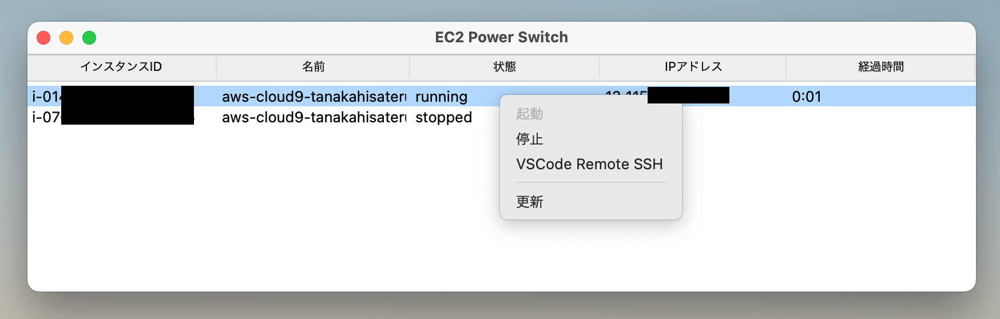

# EC2 Power Switch

AWS EC2 インスタンスを直接使った開発を支援するツールです。つまり Cloud9 の代替です。
ブラウザ内エディタの代わりに、VSCode のリモート SSH 接続を使います。



## できること

- EC2 インスタンスのステータス表示
- リストに表示されたインスタンスの起動と停止
- VSCode でリモート SSH を使った開発

## 必要なもの

- Python 3 インタプリタ
- aws-cli コマンド (key/secret の confugure が済んでいること)
- Remote - SSH 拡張をインストールした VSCode (code コマンドで起動可能)

Python の追加ライブラリは不要です。一般的な Python ディストリビューションのビルトイン機能で動く想定です。
もしかしたら python-tk が別インストール単位になっていて、追加で必要かもしれません。

## 使い方

instances.ini をカレントディレクトリに作成し、管理したいインスタンスの数だけセクションを追加します。

```ini
[instance1]
id = i-11111111111111111
user = ec2-user
directory = /path/to/directory1
```

セクションには id が必要です。user と directory を設定すると、SSH 接続時に使われます。
id 以外は、DEFAULT セクションに設定して共有してもかまいません。id はインスタンスごとに
固有なので、セクションごとに設定してください。DEFAULT の項目は、各セクションで上書きできます。

```ini
[DEFAULT]
user = ec2-user
directory = /path/to/directory
[instance1]
id = i-11111111111111111
[instance2]
id = i-22222222222222222
user = another-user
```

メインスクリプトを実行すると、インスタンスのステータスが表示されます。

```bash
python3 main.py
```

instances.ini をカレントディレクトリに置けない場合は、ファイルパスを引数に指定してください。

```bash
python3 main.py --config /path/to/instances.ini
```

インスタンス ID が適切に設定されていれば、ウィンドウに各インスタンスの状態が表示され、
コンテキストメニューから各種の操作が可能になります。

## 備考

インスタンスには、AWS SSM ではなく、通常の SSH で接続します。以下の条件を満たしている必要があります。

- public_ip を持っていること
- セキュリティグループが 22 番ポートを通すように設定されていること
- EC2 インスタンスの authorized_keys に自分のデフォルトキーが登録されていること

起動のたびに public_ip が変わると、SSH と VSCode は、いちいち初めてのホストだと認識します。
Elastic IP を確保して割り当てておくのがおすすめです。

Cloud9 のような自動停止は行いません。起動からの経過時間に注意してください。
